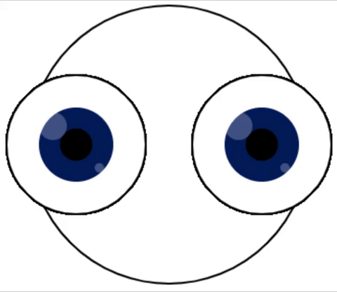

`تدوير ()` يحرك الشاشة حول مجموعة إحداثيات. في المعالجة، يكون الدوران باستخدام **نصف قطر** ولكن يمكنك تحويل ذلك إلى **درجة** باستخدام الدالة `radians()` ، ` rotate(radians(90))` بمعنى أنها ستدور بمقدار `90` درجة.

تعمل الأرقام الموجبة على تدوير الكائنات في اتجاه عقارب الساعة وتدور الأرقام السالبة الكائنات عكس اتجاه عقارب الساعة.

### تدوير الشاشة

في هذا المثال ، يتم وضع صورة الكوكب مع وجود مركز الكوكب في منتصف الشاشة. يتم ضبط الشاشة أن تدور حول المركز درجة واحدة في كل مرة يتم إعادة رسمها.

--- code ---
---
language: python
---

def draw(): translate(200,200) # The middle of the screen for i in range(frame_count): image(planet, -150, -150, 300, 300) rotate(radians(1))

--- /code ---

### تدوير أجزاء من الرسم

في هذا المثال، يتم تدوير الشاشة بمقدار `45` درجة عند رسم العينين لمنحها الانطباع بأنها تتحرك.

ومع ذلك، لمحاذاة العيون أفقيًا عبر الشاشة، نريد استعادة الإعدادات الأصلية قبل رسم العين التالية. تقوم الدالة `pushMatrix ()` بحفظ الإعدادات كما كانت قبل رسم العين الأولى ثم تستعيد الدالة `popMatrix ()` هذه الإعدادات قبل رسم العين الثانية.

تتم إعادة تعيين جميع الترجمات والتدويرات في كل مرة يبدأ فيها الرسم `draw()` مرة أخرى.

--- code ---
---
language: python
---

def draw():

  global BLUE, BLACK, WHITE

  BLUE = color(1, 32, 100) BLACK = color(0, 0, 0) WHITE = color(255, 255, 255)

  background(WHITE) translate(width/2, height/2) # Move screen to the middle

  stroke(BLACK) ellipse(0, 0, 300, 300) # Head

  pushMatrix() # Saves current screen settings

  translate(-100, 0) # Move screen to the left for left eye for i in range(frame_count): eye() rotate(radians(45))

  popMatrix() # Restores previous screen settings (removes the eye translation and rotation)

  translate(100, 0) # Move screen to the right for right eye for i in range(frame_count): eye() rotate(radians(45))

def eye():

# اصنع عين
  fill(WHITE) ellipse(0, 0, 150, 150) # Outer eye no_stroke() fill(BLUE) ellipse(0, 0, 80, 80) # Iris fill(BLACK) ellipse(0, 0, 35, 35) # Pupil fill(WHITE, 70) ellipse(-25, -20, 30, 30) # Catchlight 1 with opacity ellipse(25, 25, 10, 10) # Catchlight 2 with opacity

--- /code ---
