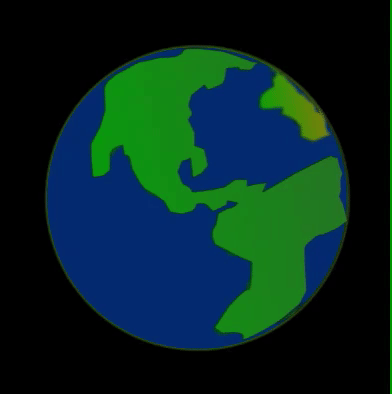

Mae `rotate()` yn symud y sgrin o amgylch set o gyfesurynnau. Yn Processing, mae cylchdroadau'n digwydd mewn **radianau** ond fe allwch chi ysgrifennu rhif y **graddau** a defnyddio'r swyddogaeth `radians()` i'w trosi'n radianau, byddai `rotate(radians(90))` yr un peth â chylchdroi `90` gradd.

Mae rhifau positif yn cylchdroi gwrthrychau yn glocwedd ac mae rhifau negatif yn cylchdroi yn wrthglocwedd.

### Cylchdroi'r sgrin

Yn yr enghraifft hon, mae'r delwedd o'r blaned wedi'i lleoli gyda chanol y blaned yng nghanol y sgrin. Mae'r sgrin wedi'i gosod i gylchdroi o amgylch y canol gan symud un radd bob tro mae'n cael ei hail-lunio.

--- code ---
---
language: python
---

def draw():
  translate(200,200) # Canol y sgrin
  for i in range(frame_count):
    image(planet, -150, -150, 300, 300) 
    rotate(radians(1))

--- /code ---

### Cylchdroi rhannau o'r lluniad

Yn yr enghraifft hon, mae'r sgrin yn cael ei chylchdroi `45` gradd pan fydd y llygaid yn cael eu llunio i roi'r argraff eu bod yn symud o gwmpas.

Ond i alinio'r llygaid yn llorweddol ar draws y sgrin, rydyn ni am adfer y gosodiadau gwreiddiol cyn llunio'r llygad nesaf. Mae'r swyddogaeth `pushMatrix()` yn cadw'r gosodiadau fel yr oedden nhw cyn llunio'r llygad gyntaf ac yna mae'r swyddogaeth `popMatrix()` yn adfer y gosodiadau hynny cyn llunio'r ail lygad.

Mae'r holl drosiadau a chylchdroadau'n cael eu hailosod bob tro mae `draw()` yn dechrau eto.

--- code ---
---
language: python
---

def draw():
  
  global GLAS, DU, GWYN

  GLAS = color(1, 32, 100)
  DU = color(0, 0, 0)
  GWYN = color(255, 255, 255)
 
  background(GWYN)
  translate(width/2, height/2) # Symud y sgrin i'r canol 

  stroke(DU)
  ellipse(0, 0, 300, 300) # Pen
  
  pushMatrix() # Cadw'r gosodiadau sgrin presennol
  
  translate(-100, 0) # Symud y sgrin i'r chwith ar gyfer y llygad chwith
  for i in range(frame_count):
    llygad()
    rotate(radians(45))

  popMatrix() # Adfer y gosodiadau sgrin blaenorol (tynnu trosiad a chylchdroad y llygad)
  
  translate(100, 0) # Symud y sgrin i'r dde ar gyfer y llygad dde
  for i in range(frame_count):
    llygad()
    rotate(radians(45))    
  
def llygad():
  
# Creu llygad
  fill(GWYN)
  ellipse(0, 0, 150, 150) # Tu allan y llygad
  no_stroke()
  fill(GLAS)
  ellipse(0, 0, 80, 80) # Iris
  fill(DU)
  ellipse(0, 0, 35, 35) # Cannwyll llygad
  fill(GWYN, 70)
  ellipse(-25, -20, 30, 30) # Goleubwynt 1 gydag afloywder
  ellipse(25, 25, 10, 10) # Goleubwynt 2 gydag afloywder
--- /code ---
