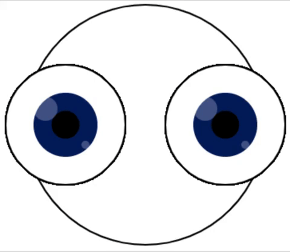

Η `rotate()` μετακινεί την οθόνη γύρω από ένα ζεύγος συντεταγμένων. Στην Διαδικασία, οι περιστροφές γίνονται σε **ακτίνια**, αλλά μπορείς να τα μετατρέψεις σε **μοίρες** χρησιμοποιώντας τη συνάρτηση `radians()`, `rotate(radians(90))` θα ήταν ίσο με περιστροφή `90` μοίρες.

Οι θετικοί αριθμοί περιστρέφουν αντικείμενα προς τη φορά των δεικτών του ρολογιού και οι αρνητικοί αριθμοί τα περιστρέφουν αριστερόστροφα.

### Περιστρέφοντας την οθόνη

Σε αυτό το παράδειγμα, η εικόνα του πλανήτη τοποθετείται με το κέντρο του πλανήτη στη μέση της οθόνης. Η οθόνη έχει ρυθμιστεί να περιστρέφεται γύρω από τη μέση κινούμενη κατά μία μοίρα κάθε φορά που επανασχεδιάζεται.

--- code ---
---
language: python
---

def draw(): 
  translate(200,200) # Το μέσο της οθόνης
  for i in range(frame_count): 
    image(planet, -150, -150, 300, 300) 
    rotate(radians(1))

--- /code ---

### Περιστρέφοντας μέρη του σχεδίου

Σε αυτό το παράδειγμα, η οθόνη περιστρέφεται κατά `45` μοίρες όταν σχεδιάζονται τα μάτια για να τους δώσει την εντύπωση ότι κινούνται.

Ωστόσο, για να ευθυγραμμιστούν τα μάτια οριζόντια κατά μήκος της οθόνης, θέλουμε να επαναφέρουμε τις αρχικές ρυθμίσεις πριν σχεδιάσουμε το επόμενο μάτι. Η συνάρτηση `pushMatrix()` αποθηκεύει τις ρυθμίσεις όπως ήταν πριν από τη σχεδίαση του πρώτου ματιού και, στη συνέχεια, η συνάρτηση `popMatrix()` επαναφέρει αυτές τις ρυθμίσεις πριν σχεδιαστεί το δεύτερο μάτι.

Όλες οι μεταφορές και οι περιστροφές επαναφέρονται κάθε φορά που το `draw()` ξεκινά ξανά.

--- code ---
---
language: python
---

def draw():
  
  global BLUE, BLACK, WHITE

  BLUE = color(1, 32, 100)
  BLACK = color(0, 0, 0)
  WHITE = color(255, 255, 255)
 
  background(WHITE)
  translate(width/2, height/2) # Μετακίνησε την οθόνη στη μέση 

  stroke(BLACK)
  ellipse(0, 0, 300, 300) # Κεφάλι
  
  pushMatrix() # Αποθηκεύει τις τρέχουσες ρυθμίσεις οθόνης
  
  translate(-100, 0) # Μετακίνησε την οθόνη προς τα αριστερά για το αριστερό μάτι
  for i in range(frame_count):
    eye()
    rotate(radians(45))

  popMatrix() # Επαναφέρει τις προηγούμενες ρυθμίσεις οθόνης (καταργεί τη μεταφορά και την περιστροφή των ματιών)
  
  translate(100, 0) # Μετακίνησε την οθόνη προς τα δεξιά για το δεξιό μάτι
  for i in range(frame_count):
    eye()
    rotate(radians(45))    
  
def eye():

# Δημιούργησε ένα μάτι
  fill(WHITE)
  ellipse(0, 0, 150, 150) # Εξωτερικό μάτι
  no_stroke()
  fill(BLUE)
  ellipse(0, 0, 80, 80) # Ίριδα
  fill(BLACK)
  ellipse(0, 0, 35, 35) # Κόρη
  fill(WHITE, 70)
  ellipse(-25, -20, 30, 30) # Λαμπύρισμα 1 με αδιαφάνεια
  ellipse(25, 25, 10, 10) # Λαμπύρισμα 2 με αδιαφάνεια

--- /code ---

