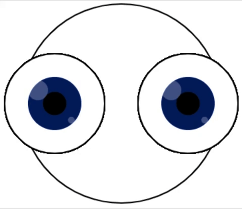

`rotate()` sposta lo schermo attorno a un insieme di coordinate. In Processing, le rotazioni avvengono in **radianti** ma puoi scrivere il numero di **gradi** e usare la funzione `radians()` per convertirlo in radianti, `rotate(radians(90))` equivale a ruotare di `90` gradi.

I numeri positivi fanno ruotare gli oggetti in senso orario mentre i numeri negativi in senso antiorario.

### Rotazione dello schermo

In questo esempio, l'immagine del pianeta è posizionata con il centro del pianeta al centro dello schermo. Lo schermo è impostato per ruotare attorno al centro spostandosi di un grado ogni volta che viene ridisegnato.

--- code ---
---
language: python
---

def draw(): translate(200,200)  # The middle of the screen for i in range(frame_count): image(planet, -150, -150, 300, 300) rotate(radians(1))

--- /code ---

### Rotazione di una parte del disegno

In questo esempio, lo schermo viene ruotato di `45` gradi alla volta per dare l'impressione che gli occhi si muovano.

Tuttavia, per allineare gli occhi orizzontalmente sullo schermo, procediamo ripristinando le impostazioni originali prima di disegnare l'occhio successivo. La funzione `pushMatrix()` salva i valori delle impostazioni prima che vengano modificate per disegnare il primo occhio, quindi la funzione `popMatrix()` ripristina tali impostazioni prima che venga disegnato il secondo occhio.

Tutte le traslazioni e le rotazioni vengono ripristinate a ogni esecuzione di `draw()`.

--- code ---
---
language: python
---

def draw(): global BLUE, BLACK, WHITE

    BLUE = Color(1, 32, 100)
    BLACK = Color(0, 0, 0)
    WHITE = Color(255, 255, 255)
    
    background(WHITE)
    translate(width/2, height/2)  # Move screen to the middle 
    
    stroke(BLACK)
    ellipse(0, 0, 300, 300)  # Head
    
    push_matrix()  # Saves current screen settings
    
    translate(-100, 0)  # Move screen to the left for left eye
    for i in range(frame_count):
        eye()
        rotate(radians(45))
    
    pop_matrix()  # Restores previous screen settings (removes the eye translation and rotation)
    
    translate(100, 0)  # Move screen to the right for right eye
    for i in range(frame_count):
        eye()
        rotate(radians(45))

def eye(): # Create an eye fill(WHITE) ellipse(0, 0, 150, 150)  # Outer eye no_stroke() fill(BLUE) ellipse(0, 0, 80, 80)  # Iris fill(BLACK) ellipse(0, 0, 35, 35)  # Pupil fill(WHITE, 70) ellipse(-25, -20, 30, 30)  # Catchlight 1 with opacity ellipse(25, 25, 10, 10)  # Catchlight 2 with opacity

--- /code ---
