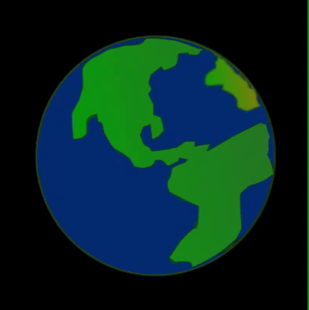

`rotate()`は、座標に沿って画面を回転させます。 Processingでは、回転には**radians**（ラジアン）を指定しますが、数字の**角度**は`radians()`関数を使ってラジアンに変換できます。`rotate(radians(90))`は`90`度回転するのと同じことになります。

正の数値は物体を時計回りに回転させ、負の数値は反時計回りに回転させます。

### 画面を回転させる

この例では、惑星の中心が画面の中心になるように、惑星の画像が配置されています。 画面が再描画されるたびに1度ずつ回転するよう設定されています。

--- code ---
---
language: python
---

def draw():
  translate(200,200) # 画面中央
  for i in range(frame_count):
    image(planet, -150, -150, 300, 300) 
    rotate(radians(1))

--- /code ---

### 図形の一部分を回転させる

この例では、目を描くたびに画面を`45`度ずつ回転させ、目がくるくる回っているように見せています。

ただし、両目を画面全体で水平に揃えるには、次の目を描画する前に座標の移動や回転を元の設定に戻す必要があります。 `pushMatrix()`関数で最初の目が描画される前の設定を保存し、2番目の目が描画される前に`popMatrix()`関数で設定を復元します。

`draw()`が実行されるたびに、すべての平行移動と回転がリセットされます。

--- code ---
---
language: python
---

def draw():
  
  global BLUE, BLACK, WHITE

  BLUE = color(1, 32, 100)
  BLACK = color(0, 0, 0)
  WHITE = color(255, 255, 255)
 
  background(WHITE)
  translate(width/2, height/2) # 画面を中央に移動する 

  stroke(BLACK)
  ellipse(0, 0, 300, 300) # 頭
  
  pushMatrix() # 現在の画面設定を保存する
  
  translate(-100, 0) # 左目を描くのに画面を左に移動する
  for i in range(frame_count):
    eye()
    rotate(radians(45))

  popMatrix() # 元の画面設定を復元する（目の平行移動と回転を元に戻す）
  
  translate(100, 0) # 右目を描くのに画面を右に移動する
  for i in range(frame_count):
    eye()
    rotate(radians(45))    
  
def eye():

# 目を作る
  fill(WHITE)
  ellipse(0, 0, 150, 150) # 目の外側
  no_stroke()
  fill(BLUE)
  ellipse(0, 0, 80, 80) # 虹彩
  fill(BLACK)
  ellipse(0, 0, 35, 35) # 瞳
  fill(WHITE, 70)
  ellipse(-25, -20, 30, 30) # 不透明度設定を使った瞳に移りこんだ光1
  ellipse(25, 25, 10, 10) # 不透明度設定を使った瞳に移りこんだ光2
--- /code ---
