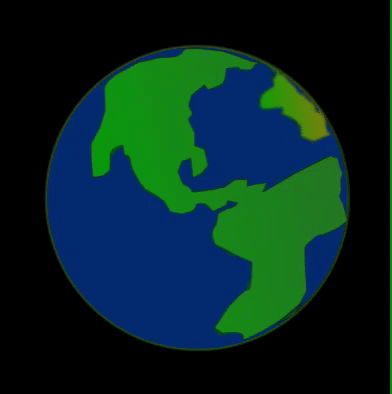

`rotate()` rotaciona a tela em torno de um conjunto de coordenadas. Na execução do programa, as rotações acontecem em **radianos**, mas você pode escrever o número de **graus** e usar a função `radians()` para convertê-lo em radianos, `rotate(radians(90))` seria igual a girar `90` graus.

Números positivos giram os objetos no sentido horário e números negativos no sentido anti-horário.

### Girando a tela

Neste exemplo, o planeta está centralizado no meio da tela. A tela está configurada para girar ao redor do centro, movendo-se um grau cada vez que é redesenhada.

--- code ---
---
language: python
---

def draw():
  translate(200,200) # O meio da tela
  for i in range(frame_count):
    image(planeta, -150, -150, 300, 300) 
    rotate(radians(1))

--- /code ---

### Partes rotativas do desenho

Neste exemplo, a tela é girada em `45` graus quando os olhos estão sendo desenhados para dar a impressão de que estão se movendo.

No entanto, para alinhar os olhos horizontalmente na tela, queremos restaurar as configurações originais antes de desenhar o próximo olho. A função `pushMatrix()` salva as configurações como estavam antes do primeiro olho ser desenhado, então a função `popMatrix()` restaura essas configurações antes que o segundo olho seja desenhado.

Todas as translações e rotações são redefinidas toda vez que `draw()` começa novamente.

--- code ---
---
language: python
---

def draw():
  
  global AZUL, PRETO, BRANCO

  AZUL = color(1, 32, 100)
  PRETO = color(0, 0, 0)
  BRANCO = color(255, 255, 255)
 
  background(BRANCO)
  translate(width/2, height/2) # Move a tela para o meio 

  stroke(PRETO)
  ellipse(0, 0, 300, 300) # Cabeça
  
  pushMatrix() # Salva as configurações atuais da tela
  
  translate(-100, 0) # Movimenta o olho esquerdo
  for i in range(frame_count):
    olho()
    rotate(radians(45))

  popMatrix() # Restaura as configurações anteriores (remove a translação e a rotação dos olhos)
  
  translate(100, 0) # Movimenta o olho direito
  for i in range(frame_count):
    olho()
    rotate(radians(45))    
  
def olho():
  
# Crie um olho
  fill(BRANCO)
  ellipse(0, 0, 150, 150) # Circulo externo do olho
  no_stroke()
  fill(AZUL)
  ellipse(0, 0, 80, 80) # Íris
  fill(PRETO)
  ellipse(0, 0, 35, 35) # Pupila
  fill(BRANCO, 70)
  ellipse(-25, -20, 30, 30) # Brilhos nos olhos 1
  ellipse(25, 25, 10, 10) # Brilhos nos olhos 2

--- /code ---
